<div align="center">

</div>

<div align="center">

[](https://git.io/typing-svg)

</div>

<div align="center">


</div>

---

<div align="center">

### 🎬 Watch My 30-Second Intro

<a href="https://youtu.be/W3Zmlo3D49Y">
  
</a>

<br/>

[](https://www.youtube.com/watch?v=W3Zmlo3D49Y&autoplay=1&mute=1&loop=1&playlist=W3Zmlo3D49Y)

<sub>Click to play. Starts muted and loops, so unmute whenever you want sound.</sub>

</div>

---

<div align="center">

## 🔗 Quick Links

[](mailto:thezubairh@gmail.com?subject=Project%20Inquiry%20-%20Hiring%20Zubair&body=Hi%20Zubair%2C%0A%0AI%27d%20like%20to%20discuss%20a%20project%20with%20you.%0A%0AProject%3A%20%0ATimeline%3A%20%0ABudget%3A%20%0A%0AThanks%21)
[](https://zubair-hussain-portfolio.detroonshah.workers.dev/)
[](https://zubair-xovato.blogspot.com/)
[](mailto:thezubairh@gmail.com)
[](https://github.com/Zubair-hussain)
[](https://www.instagram.com/detro_onshah)

</div>

---

<table>
<tr>
<td width="50%" valign="top">

</td>
<td width="50%" valign="top">

</td>
</tr>
</table>

---

## 🧠 Who Am I?

> *A Full Stack + AI developer who turns ideas into polished, production-ready products, and has done it for real clients across global freelancing platforms.*

- 🎓 **Information Technology** undergraduate, always learning, always building
- 💼 **Active Freelancer** on **Upwork · Fiverr · LinkedIn**, delivering real value to real clients
- 🤖 Built **AI-powered apps** including Text-to-Image generators and ML prediction systems
- 📊 Completed an **AI Engineering Internship** with hands-on data analysis and ML pipelines
- 🔭 Currently focused on **Full Stack + AI**, where good UX meets intelligent systems
- ✍️ I write about what I build on my [blog](https://zubair-xovato.blogspot.com/)
- 🌍 Goal: work in a **global tech environment** solving real problems at scale

---

## ✍️ From My Blog

<div align="center">

[](https://zubair-xovato.blogspot.com/)

</div>

<!--START_SECTION:blog-->
<!-- Latest posts appear here automatically once the blog workflow runs -->
<!--END_SECTION:blog-->

<div align="center">
<sub>Notes on full stack builds, AI experiments, and freelancing lessons.</sub>
</div>

---

## 🆕 Latest Repositories

<!--START_SECTION:repos-->
- [Leadgen_project-](https://github.com/Zubair-hussain/Leadgen_project-) - No description yet `JavaScript`
- [HTML-TO-DESIGN-](https://github.com/Zubair-hussain/HTML-TO-DESIGN-) - No description yet `TypeScript` Stars: 1
- [Xovato-cpu-ai-studio](https://github.com/Zubair-hussain/Xovato-cpu-ai-studio) - Adds deploy-ready FastAPI backend package with CPU model layout, docs, env examples, and tests. `Python` Stars: 2
- [AI-Powered-Quiz-and-Assessment-Platform](https://github.com/Zubair-hussain/AI-Powered-Quiz-and-Assessment-Platform) - Wayground is a full-stack AI-powered quiz platform where teachers can create and manage quizzes, generate questions with AI, and track student results. Students can browse quizzes, take timed assessments, review their answers, and see their score history. `JavaScript` Stars: 1
- [GestureCam-Studio](https://github.com/Zubair-hussain/GestureCam-Studio) - GestureCam Studio is a Python-based hand gesture camera system using OpenCV and MediaPipe. It supports live hand tracking, gesture detection, skeleton landmarks, air writing, puzzle mode, FPS monitoring, and phone camera streaming through a web interface. `Python` Stars: 1
<!--END_SECTION:repos-->

<div align="center">
<sub>⚙️ Auto-synced, updates whenever a new repo is created</sub>
</div>

---

## 🏆 Achievements & Milestones

<div align="center">

| 🥇 Achievement | 📌 Details |
|:---|:---|
| 💼 **Freelance Success** | Multiple clients on Upwork, Fiverr and LinkedIn |
| 🤖 **AI Engineering Internship** | Real-world data preprocessing and ML pipeline work |
| 🧪 **Kaggle Top 10%** | Ranked in the top 10% across multiple competitions |
| 📦 **35+ GitHub Repositories** | Projects across web, AI and mobile |
| 🎯 **Text-to-Image AI App** | Full AI image generation pipeline using deep learning |
| 📈 **Salary Prediction ML Model** | End-to-end ML with preprocessing, training and deployment |
| 🎬 **IMDB Data Analysis** | Data analysis on a 1000+ movie dataset |
| 📱 **Full Stack & Mobile Projects** | React, Next.js, Node.js and mobile applications |

</div>

---

## 🎓 Certifications

<div align="center">


</div>

---

## 🛠️ Tech Stack

### 🌐 Frontend & Mobile


### ⚙️ Backend & DevOps


### 🤖 AI / Data Science


---

## 🚀 Featured Projects

<div align="center">

| 🔥 Project | 📝 Description | 🛠 Stack | 🔗 Link |
|:---|:---|:---|:---:|
| **Text-To-Image Generator** | Converts text prompts into generated images using deep learning | Python, Deep Learning | [View](https://github.com/Zubair-hussain/Text-To-Image-) |
| **IMDB Top 1000 Analysis** | Data preprocessing and visualization, AI internship task | Python, Pandas, Jupyter | [View](https://github.com/Zubair-hussain/imdb-top1000-analysis) |
| **Salary Prediction ML** | End-to-end linear regression with preprocessing and deployment | Python, Scikit-learn | [View](https://github.com/Zubair-hussain/Salary-Prediction-using-Traditional-ML-Techniques.) |
| **Movie App** | Dynamic movie browsing app with real-time data | JavaScript | [View](https://github.com/Zubair-hussain/Movie-App) |
| **MVC Task Manager** | Task management app using MVC architecture | JavaScript | [View](https://github.com/Zubair-hussain/MVC-Task-) |
| **Promise Task** | Deep dive into async JS with Promises | JavaScript | [View](https://github.com/Zubair-hussain/Promise-Task) |
| **React Dynamic Project** | Dynamic app built with React and Vite | React, Vite | [View](https://github.com/Zubair-hussain/React-dynamic-project) |
| **Zikr Counter (Count)** | Minimalist digital counter for recitations | CSS | [View](https://github.com/Zubair-hussain/Count) |

</div>

---

## 📊 GitHub Stats

<div align="center">
  
  
</div>

<div align="center">
  
  
</div>

---

## 💼 Freelance & Availability

<div align="center">

### 🟢 Currently Available for Freelance Projects

I have worked with clients across **Upwork**, **Fiverr** and **LinkedIn**, delivering full stack web apps, AI integrations and data solutions built around real business needs.

**What I deliver**

⚡ Fast, clean, production-ready code &nbsp;·&nbsp; 🎯 Clear communication and on-time delivery &nbsp;·&nbsp; 🔄 Long-term collaboration mindset &nbsp;·&nbsp; 🤝 Client satisfaction first

<br/>

[](mailto:thezubairh@gmail.com?subject=Project%20Inquiry%20-%20Hiring%20Zubair&body=Hi%20Zubair%2C%0A%0AI%27d%20like%20to%20discuss%20a%20project%20with%20you.%0A%0AProject%3A%20%0ATimeline%3A%20%0ABudget%3A%20%0A%0AThanks%21)

</div>

---

## 🌐 Let's Connect

<div align="center">

[](https://zubair-hussain-portfolio.detroonshah.workers.dev/)
[](https://zubair-xovato.blogspot.com/)
[](mailto:thezubairh@gmail.com)
[](https://github.com/Zubair-hussain)
[](https://www.instagram.com/detro_onshah)

</div>

---

## 🔎 SEO & AI Discoverability

This profile ships with `llms.txt` and `robots.txt` so search engines and AI assistants can read a clean, structured summary of who I am and what I build.

<details>
<summary><b>📄 llms.txt</b> — structured summary for AI crawlers</summary>

```txt
# Zubair Hussain Shah

> Full Stack Developer and AI Engineer. Builds production web applications with React, Next.js and Node.js, and AI/ML systems with Python. Available for freelance work.

## About

- Name: Zubair Hussain Shah
- Role: Full Stack Developer, AI Engineer, Freelancer
- Contact: thezubairh@gmail.com
- Availability: open to freelance projects and collaborations
- Platforms: Upwork, Fiverr, LinkedIn
- Education: Information Technology undergraduate
- Experience: AI Engineering Internship (data preprocessing, ML pipelines), multiple delivered client projects

## Links

- [Portfolio](https://zubair-hussain-portfolio.detroonshah.workers.dev/): live portfolio with projects and contact details
- [Blog](https://zubair-xovato.blogspot.com/): writing on full stack development, AI experiments and freelancing
- [GitHub](https://github.com/Zubair-hussain): 35+ repositories across web, AI and mobile
- [Video introduction](https://youtu.be/W3Zmlo3D49Y): short intro video
- [Instagram](https://www.instagram.com/detro_onshah)
- [Email](mailto:thezubairh@gmail.com)

## Skills

- Frontend: HTML5, CSS3, JavaScript, TypeScript, React, Next.js, Tailwind CSS, Vite
- Backend: Node.js, Firebase, Cloudflare Workers, REST APIs
- AI and data: Python, Pandas, NumPy, scikit-learn, Jupyter, Kaggle
- Tools: Git, GitHub, Postman, VS Code, Figma

## Selected projects

- [Text-To-Image Generator](https://github.com/Zubair-hussain/Text-To-Image-): deep learning pipeline turning text prompts into images
- [AI Powered Quiz and Assessment Platform](https://github.com/Zubair-hussain/AI-Powered-Quiz-and-Assessment-Platform): full stack quiz platform with AI question generation
- [Xovato CPU AI Studio](https://github.com/Zubair-hussain/Xovato-cpu-ai-studio): deploy-ready FastAPI backend with CPU model layout
- [GestureCam Studio](https://github.com/Zubair-hussain/GestureCam-Studio): OpenCV and MediaPipe hand gesture camera system
- [Salary Prediction ML](https://github.com/Zubair-hussain/Salary-Prediction-using-Traditional-ML-Techniques.): end-to-end regression model
- [IMDB Top 1000 Analysis](https://github.com/Zubair-hussain/imdb-top1000-analysis): data analysis on a 1000 movie dataset

## Hiring

To hire or start a project, email thezubairh@gmail.com with the project scope, timeline and budget.
```

</details>

<details>
<summary><b>🤖 robots.txt</b> — crawler rules</summary>

```txt
# robots.txt - Zubair Hussain Shah
# Portfolio: https://zubair-hussain-portfolio.detroonshah.workers.dev/
# Contact: thezubairh@gmail.com

User-agent: *
Allow: /

# AI crawlers and assistants: allowed, see /llms.txt for a structured summary
User-agent: GPTBot
Allow: /

User-agent: OAI-SearchBot
Allow: /

User-agent: ChatGPT-User
Allow: /

User-agent: ClaudeBot
Allow: /

User-agent: Claude-Web
Allow: /

User-agent: PerplexityBot
Allow: /

User-agent: Google-Extended
Allow: /

User-agent: Applebot-Extended
Allow: /

User-agent: CCBot
Allow: /

# Nothing private to hide
Disallow: /admin/
Disallow: /*.json$

Sitemap: https://zubair-hussain-portfolio.detroonshah.workers.dev/sitemap.xml
```

</details>

> ⚠️ These two files only take effect when served from a website root, so the live copies belong at
> `https://zubair-hussain-portfolio.detroonshah.workers.dev/llms.txt` and `/robots.txt`.
> The copies in this repo are the source of truth that gets deployed there.

---

<!--
SEO keywords: Zubair Hussain Shah, full stack developer, AI engineer, React developer,
Next.js developer, Node.js developer, Python machine learning, freelance web developer,
Upwork Fiverr freelancer, hire full stack developer, AI app development, Pakistan developer.
Contact: thezubairh@gmail.com
Portfolio: https://zubair-hussain-portfolio.detroonshah.workers.dev/
Blog: https://zubair-xovato.blogspot.com/
-->

<div align="center">

</div>
